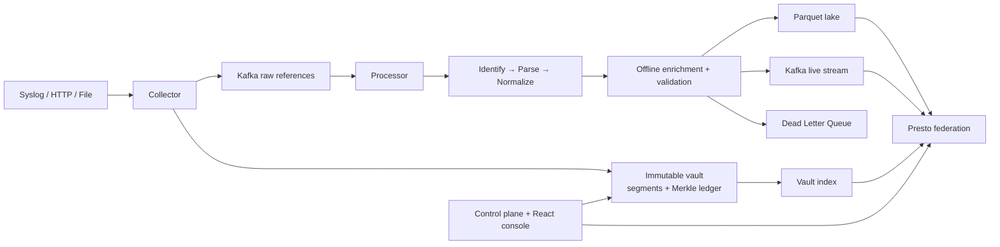

# LogKrama architecture

LogKrama turns heterogeneous telemetry into queryable, defensible evidence.
The design separates ingestion, preserved bytes, normalized records, and
investigation so a parser correction or dashboard failure cannot erase the
original event.

## Trust boundary

The collector writes raw bytes before interpretation. It returns a content
hash, segment id, byte offset, and length; downstream stages carry this
reference. A vault segment is Merkle-hashed and linked to the previous root.
The ledger is resumed after restart, so the proof chain spans process
lifetimes rather than one process session.

## Data plane

The processor identifies a vendor parser, applies the DSL, emits the Unified
Event Schema, enriches it using local data only, validates required fields,
and routes valid and failed records independently. Valid records become
partitioned Parquet in MinIO and a short-retention Kafka stream. Failed
records retain their raw reference in the DLQ.

## Investigation plane

Presto presents `lake`, `stream`, `meta`, and `vault` as one SQL surface.
The control plane permits only read-only SQL and controls parser publication,
source inventory, evidence reads, proof verification, and DLQ replay. The
React console provides live investigation, traceability, parser onboarding,
and the LogVerse 3D forensic view.

## Failure posture

Raw preservation happens before parsing. Parser errors are explicit DLQ
records, queries fail visibly if Presto is unavailable, and integrity failures
are reported rather than repaired or hidden. This is why LogKrama can replay
or investigate a record after a parser, UI, or downstream sink fails.
