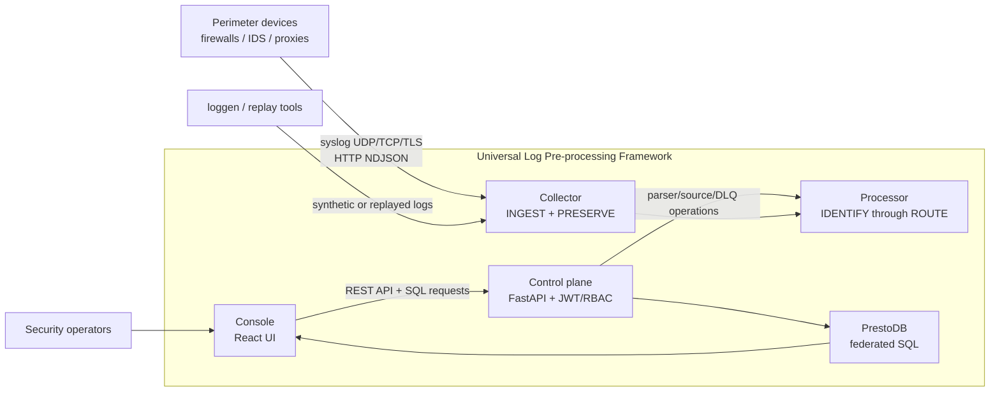
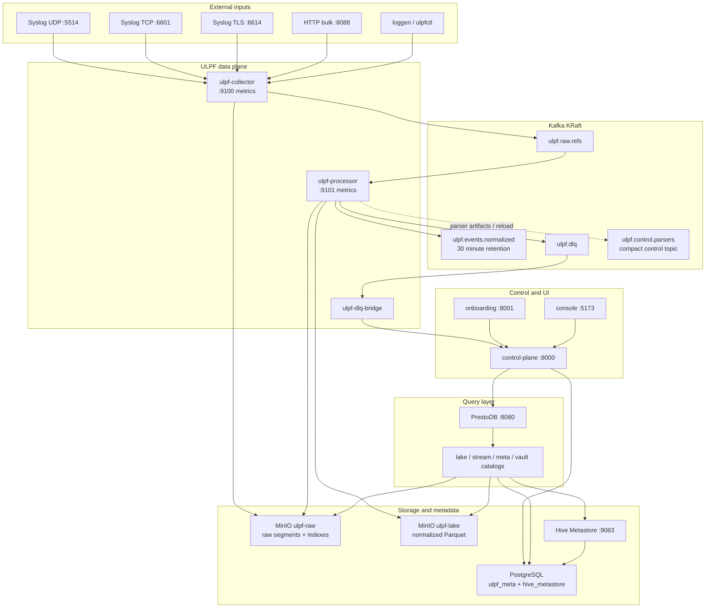
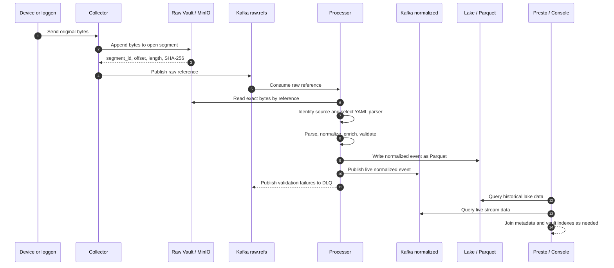
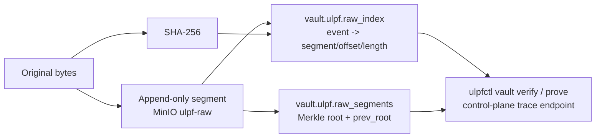
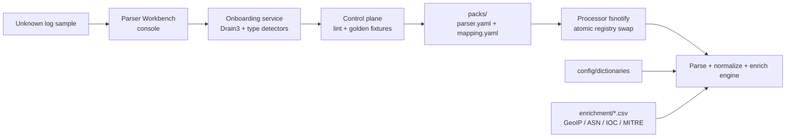
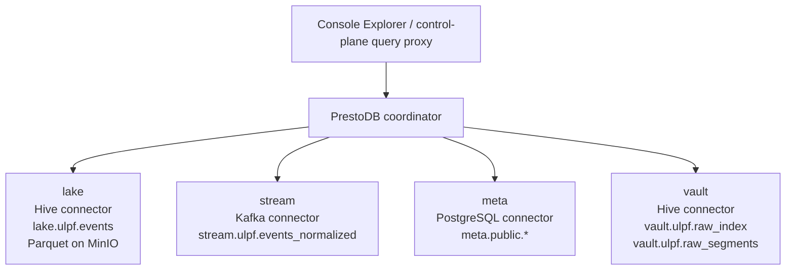
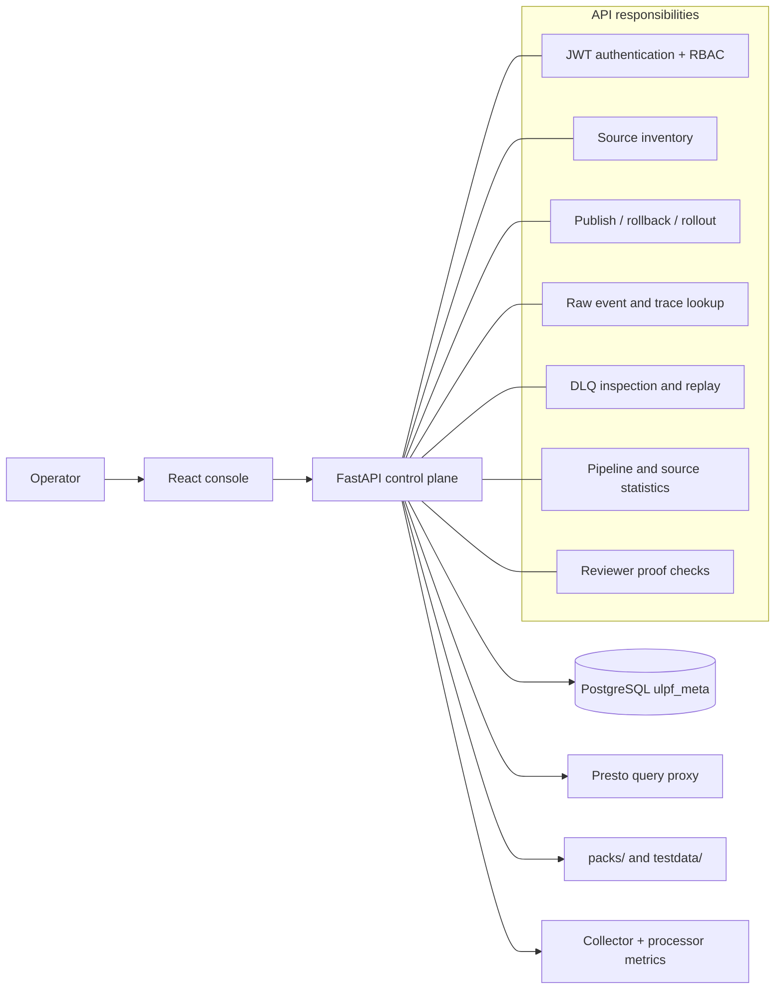
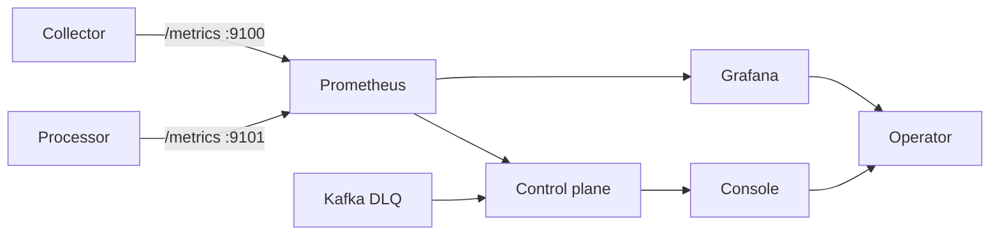

# ULPF Architecture

This document describes the Universal Log Pre-processing Framework (ULPF) as
implemented by the Docker Compose prototype. It covers the runtime topology,
the event lifecycle, storage and query federation, control-plane workflows,
and the operational boundaries that protect raw data and support an air-gapped
deployment.

## 1. System Context

ULPF accepts perimeter-device logs over UDP, TCP, TLS, and HTTP. It preserves
the original bytes before parsing, converts supported and unsupported inputs to
the Universal Event Schema (UES), enriches events from local files, and makes
the result queryable through PrestoDB.



## 2. Runtime Topology

The Compose stack has three logical layers:

1. **Data plane:** collector, processor, and DLQ bridge.
2. **Query and persistence infrastructure:** Kafka, MinIO, Hive Metastore,
   PostgreSQL, and PrestoDB.
3. **Control and observability:** control plane, onboarding service, console,
   Prometheus, and Grafana.



### Runtime endpoints

| Component | Host endpoint | Purpose |
|---|---:|---|
| Console | `http://localhost:5173` | Operator UI; dev login is `admin/admin` |
| Control plane | `http://localhost:8000` | REST API and OpenAPI docs |
| Onboarding | `http://localhost:8001` | Parser analysis and draft generation |
| PrestoDB | `http://localhost:8080` | SQL coordinator and web UI |
| MinIO API | `http://localhost:9000` | S3-compatible object storage |
| MinIO console | `http://localhost:9001` | Object-store administration |
| Prometheus | `http://localhost:9090` | Metrics and PromQL |
| Grafana | `http://localhost:3000` | Dashboards |
| Collector UDP | `localhost:5514/udp` | Syslog datagrams |
| Collector TCP | `localhost:6601` | Syslog stream input |
| Collector HTTP | `http://localhost:8088` | HTTP bulk input |
| Collector metrics | `http://localhost:9100/metrics` | Collector metrics |
| Processor metrics | `http://localhost:9101/metrics` | Processor metrics |

## 3. End-to-End Event Lifecycle

The core invariant is that the raw event is durable and addressable before
parsing can affect its representation.



### Eight pipeline stages

| Stage | Responsibility | Main implementation boundary |
|---|---|---|
| `INGEST` | Receive bytes from UDP, TCP, TLS, HTTP, or file-oriented tooling | `internal/collector` and listener packages |
| `PRESERVE` | Append unchanged bytes; calculate SHA-256 and vault coordinates | `internal/vault`, collector pipeline |
| `IDENTIFY` | Resolve explicit binding, structural shape, or parser signature | `internal/identify` |
| `PARSE` | Execute declarative YAML DSL operations | `internal/parse` |
| `NORMALIZE` | Map extracted fields into UES namespaces and `unmapped` | `internal/normalize` and `internal/schema` |
| `ENRICH` | Apply offline GeoIP, ASN, asset, identity, IOC, MITRE, and risk data | `internal/enrich` |
| `VALIDATE` | Check JSON Schema, field constraints, timestamps, and quality | `internal/validate` |
| `ROUTE` | Write lake and live outputs; copy violations to the DLQ | `internal/route` and sink packages |

## 4. Preservation and Integrity Model

Raw bytes are never reconstructed from parsed fields. The collector writes the
incoming bytes to the Raw Vault first and returns a reference containing:

- `raw.sha256`: digest of the exact original bytes.
- `raw.segment_id`: sealed segment identifier.
- `raw.offset` and `raw.length`: byte range inside the segment.
- `raw.retrieval_uri`: location used to retrieve the bytes.
- Merkle root and previous-root chain data for sealed segments.



The normalized event carries the raw reference and lineage fields alongside
the UES namespaces. This makes a lake row independently traceable back to the
exact input bytes and parser execution that produced it.

## 5. Parser and Enrichment Plane

Parsers are YAML artifacts, not compiled data-plane code. The processor mounts
`packs/`, `config/dictionaries/`, and `enrichment/` into the container. A
parser publish writes an artifact into the packs directory; the processor's
filesystem watcher validates and hot-swaps the active registry.



The enrichment path is intentionally file-backed. Runtime enrichment must not
call the public internet; generated or bundled data is loaded from the repo.

## 6. Query Federation

Presto presents four logical catalogs through one SQL endpoint. `lake` and
`vault` use Hive Metastore and Parquet on MinIO; `stream` reads the Kafka live
topic; `meta` reads PostgreSQL control-plane metadata.



The prototype's `lake` and `vault` catalog properties point to the same Hive
Metastore database and therefore expose the same Hive schema namespace. The
table data remains separated by its MinIO `external_location`:

- `s3a://ulpf-lake/normalized/` for normalized events.
- `s3a://ulpf-raw/index/` for raw index rows.
- `s3a://ulpf-raw/index/segments/` for sealed-segment rows.

After new partition directories are written, run:

```sql
CALL system.sync_partition_metadata('ulpf', 'events', 'FULL');
```

## 7. Control-Plane Workflows



The DLQ bridge consumes `ulpf.dlq` and forwards failures to the control plane
for inspection and replay workflows. The query proxy accepts read-only
`SELECT`, `EXPLAIN`, and `SHOW` statements and rejects unsupported statements
before opening a Presto connection.

## 8. Observability and Failure Boundaries



Important failure boundaries are explicit:

- A collector failure must not silently discard bytes; its listener and spool
  metrics expose pressure and drops.
- A parser or validation failure still produces a normalized failure record and
  a DLQ copy; it does not erase the preserved raw input.
- Kafka separates raw-reference handoff from processor availability.
- MinIO is the durable source for raw segments and Parquet objects; Kafka is a
  buffer/live-query tier, not the long-term evidence store.
- Presto partition metadata may lag writes until the partition sync command is
  run.
- Parser artifacts are mounted data and can be hot-reloaded without rebuilding
  or restarting the processor.

## 9. Operational Commands

From the repository root on Windows PowerShell:

```powershell
# Start an existing initialized stack.
docker compose up -d

# Check containers and all application/catalog health checks.
docker compose ps
bash scripts/verify.sh

# Generate a finite HTTP test stream.
.\bin\loggen.exe --proto=http --host=127.0.0.1 --port=8088 `
  --vendors=paloalto,fortinet,cisco,sonicwall --eps=60 `
  --malformed-rate=0.02 --duration=60s

# Register newly written lake partitions.
docker exec ulpf-presto presto-cli --server localhost:8080 `
  --catalog lake --schema ulpf `
  --execute "CALL system.sync_partition_metadata('ulpf', 'events', 'FULL')"

# Stop containers but keep volumes and initialized data.
docker compose down
```

For a complete demonstration, use `bash scripts/demo.sh`. It starts the stack,
generates traffic, waits for the short demo vault-seal window, syncs partitions,
and prints live lake counts and integrity output.

## 10. Design Guarantees and Tradeoffs

| Guarantee or decision | Mechanism |
|---|---|
| No field loss | Unmapped extracted fields are retained in `unmapped` |
| Raw-byte fidelity | Vault write precedes identification and parsing |
| Offline runtime | Enrichment data is bundled as local CSV files |
| Parser agility | YAML artifacts plus filesystem hot reload |
| Federated access | Presto joins lake, stream, metadata, and vault catalogs |
| Recoverable failures | Validation failures go to the DLQ while raw data remains addressable |
| Prototype isolation tradeoff | `lake` and `vault` share Hive metadata but use separate object prefixes |
| Deployment tradeoff | Single-node Compose topology; Kafka runs in KRaft mode without ZooKeeper |
